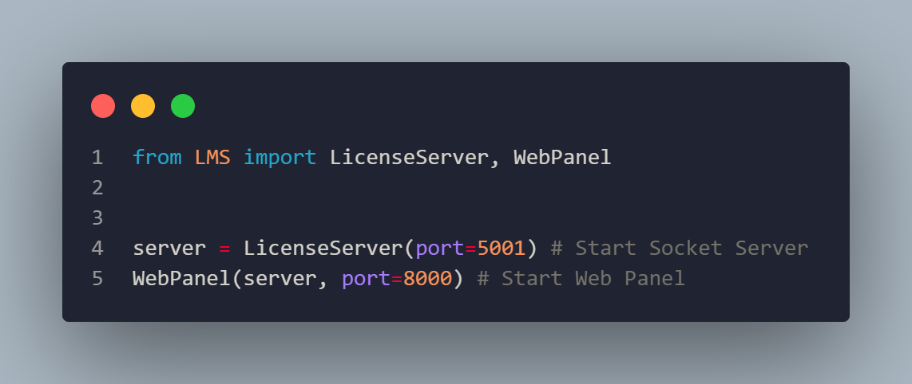
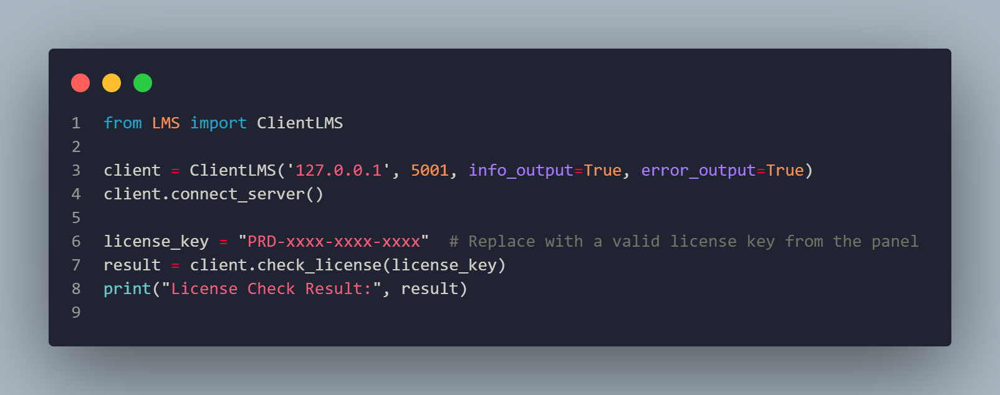

# 📦 LMS - License Management System

[](LICENSE)


[](https://github.com/CSDC-K/LMS/blob/main/LICENSE)

---


<p align="center">
  
</p>


---


## 🔥 About LMS

**LMS (License Management System)** is a lightweight and modular client-server license management solution designed to securely handle license validation and management across multiple clients using JSON-formatted license data. It supports product keys, trial licenses, and is built on Python socket communication for easy integration.

- Multi-client connection handling  
- Support for various license types (product key, trial key, etc.)  
- License data stored in JSON format  
- Simple TCP socket communication  
- Planned web panel for centralized license management (in progress)  

---

## 📋 Features

- 🔐 Support for product keys, trial keys, and custom license types  
- 🌐 Concurrent client connections and license validation  
- ⚙️ Flexible JSON-based license storage and management  
- 🛠️ Easy-to-integrate socket-based client-server architecture  
- 📈 Scalable and modular design for future expansion  

---

## 🚀 Getting Started

### Prerequisites

- Python 3.10 or higher  
- Basic knowledge of TCP sockets and Python programming  

### Installation

1. Install Module:  
```bash
pip install LMS-PY
```

### Server Codes



### Client Codes




## 📜 License

Distributed under the **MIT License**. See [`LICENSE`](LICENSE) for details.

---

## ✨ Developed With Precision By

<p align="center">
  <strong style="font-size: 1.3em; letter-spacing: 1px;">⚡ VV / KUZEY ⚡</strong><br>
  <em>Securing And Checking Licenses with elegance and raw Python power.</em>

  <em>Maybe Some JS</em>
</p>
